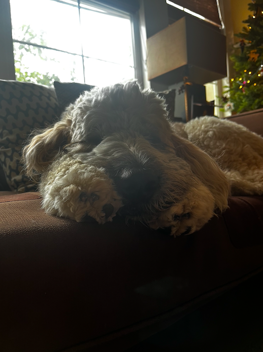

## Tucker Golpariani - My Blog - UPDATED DESCRIPTION
Nearing the end of Trimester 2 of Del Norte 2024 AP Computer Science Principles, I can say that I have learned a lot. Through both the successes and failures, the troubleshooting and the debugging, and the processes of trial and error, I have refined my computer science skills greatly. In collaborating with others, pursuing both teacher and student lessons, and experimenting and researching, I have learned so much about the foundation of the computer science world and have learned how to create with that knowledge. And we still have an entire 1/3rd left of the school year to go. I can't wait to see where the rest of the class takes me in my digital journey.

## About me
I am one of the six members in my family. In addition to my two parents, I have three siblings, one of which I am older than. I also have a dog. I was born in San Diego and have lived here in the same house for my entire life. Currently, I am an 11th grader at Del Norte High School. I like to play video games, hang out with friends and family, and enjoy nature by going on hikes, running, and bikeriding. Another hobby of mine is photography, which I have been doing since I was young.

I look forward to the experiences that lie ahead in AP Computer Science Principles through Data Structures.