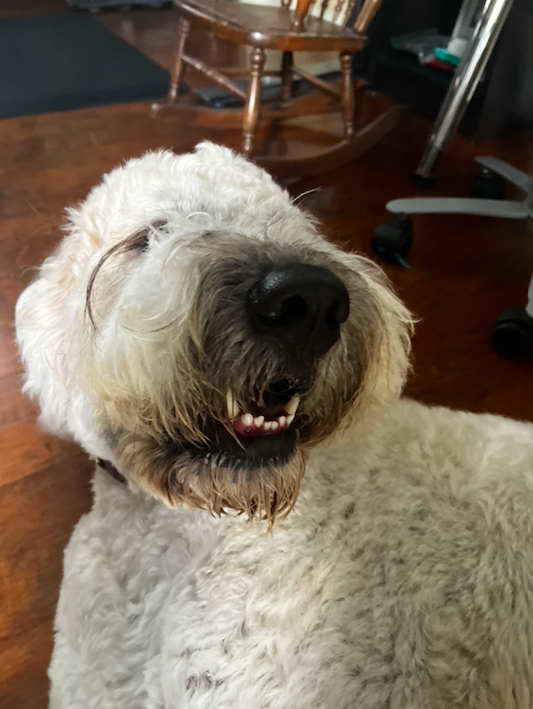

## Tucker Golpariani - My Blog
This blog marks the beginning of my true computer science journey as my first creation in a computer science class.

## About me
I am one of the six members in my family. In addition to my two parents, I have three siblings, one of which I am older than. I also have a dog. I was born in San Diego and have lived here in the same house for my entire life. Currently, I am an 11th grader at Del Norte High School. I love to play video games, hang out with friends and family, and enjoy nature by going on hikes, running, and bikeriding. Another hobby of mine is photography, which I have been doing since I was young.

I look forward to the experiences that lie ahead in AP Computer Science Principles through Data Structures.
